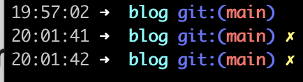

### zsh配置PS1显示时间
---
[Reevaluate the prompt expression each time a prompt is displayed in zsh](https://unix.stackexchange.com/questions/40595/reevaluate-the-prompt-expression-each-time-a-prompt-is-displayed-in-zsh)



设置prompt_subst是为了每次回车显示新行时，重新解析PS1，动态更新git状态
```
vi ~/.zshrc
setopt prompt_subst
PS1='%*%B %(?:%{%}➜ :%{%}➜ ) %{$fg[cyan]%}%c%{$reset_color%} $(git_prompt_info)'
```

### ffmpeg下载m3u8
---
`ffmpeg -i 'http://***.m3u8' -c cooy a.mp4`

`ffmpeg -user_agent "Mozilla/5.0 (Macintosh; Intel Mac OS X 10.15; rv:109.0) Gecko/20100101 Firefox/113.0" -headers "origin: https://***" -i 'http://***.m3u8` -c copy a.mp4`

 - No trailing CRLF found in HTTP header. Adding it.

 `-headers "origin: https://***"$'\r\n'`

 `-headers "origin: https://***\r\n"`


